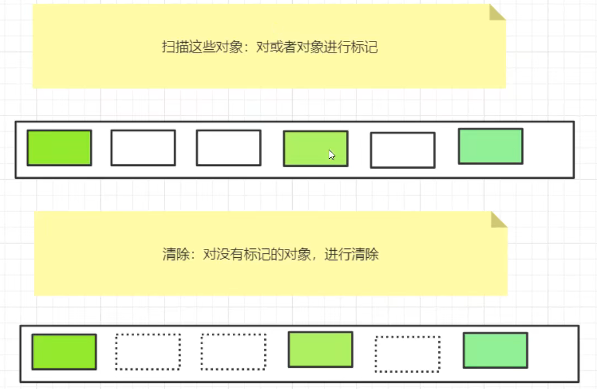
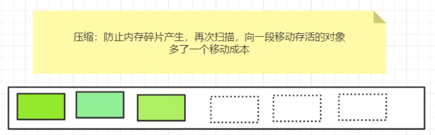

# JVM

## 组成

1. 类装载子系统
2. 字节码执行引擎
3. 运行时数据区（堆、栈、本地方法栈、方法区、程序计数器）

## 类加载

### 类加载过程

1.加载：加载指的是将类的class文件读入到内存，并为之创建一个Class对象

2.链接：当类被加载之后，系统为之生成一个对应的Class对象，接着将会进入连接阶段，连接阶段负责把类的二进制数据合并到JRE中。类连接又可分为如下3个阶段。

1)验证：验证阶段用于检验被加载的类是否有正确的内部结构，其主要包括四种验证，文件格式验证，元数据验证，字节码验证，符号引用验证。

2)准备：类准备阶段负责为类的静态变量分配内存，并设置默认初始值。

3)解析：将类的二进制数据中的符号引用替换成直接引用。

3.初始化：初始化是为类的静态变量赋予正确的初始值，准备阶段和初始化阶段看似有点矛盾，其实是不矛盾的，如果类中有语句：private static int a = 10，它的执行过程是这样的，首先字节码文件被加载到内存后，先进行链接的验证这一步骤，验证通过后准备阶段，给a分配内存，因为变量a是static的，所以此时a等于int类型的默认初始值0，即a=0,然后到解析（后面在说），到初始化这一步骤时，才把a的真正的值10赋给a,此时a=10。

### 类加载机制

- 全盘负责：所谓全盘负责，就是当一个类加载器负责加载某个Class时，该Class所依赖和引用其他Class也将由该类加载器负责载入，除非显示使用另外一个类加载器来载入。
- **双亲委派**：所谓的双亲委派，则是先让父类加载器试图加载该Class，只有在父类加载器无法加载该类时才尝试从自己的类路径中加载该类。通俗的讲，就是某个特定的类加载器在接到加载类的请求时，首先将加载任务委托给父加载器，依次递归，如果父加载器可以完成类加载任务，就成功返回；只有父加载器无法完成此加载任务时，才自己去加载。
- 缓存机制：缓存机制将会保证所有加载过的Class都会被缓存，当程序中需要使用某个Class时，类加载器先从缓存区中搜寻该Class，只有当缓存区中不存在该Class对象时，系统才会读取该类对应的二进制数据，并将其转换成Class对象，存入缓冲区中。这就是为很么修改了Class后，必须重新启动JVM，程序所做的修改才会生效的原因。

## 栈

每个方法在执行时都会在栈中创建一个栈帧(Stack Frame)用于存储局部变量表、操作数栈、动态链接、方法出口等信息。每一个方法从调用直至执行结束，就对应着一个栈帧从虚拟机栈中入栈到出栈的过程

局部变量表：存放了编译期可知的各种基本类型(boolean、byte、char、short、int、float、long、double)、对象引用(reference 类型)和 returnAddress 类型(指向了一条字节码指令的地址)

StackOverflowError：线程请求的栈深度大于虚拟机所允许的深度
OutOfMemoryError：如果虚拟机栈可以动态扩展，而扩展时无法申请到足够的内存

## 本地方法栈

区别于 Java 虚拟机栈的是，Java 虚拟机栈为虚拟机执行 Java 方法(也就是字节码)服务，而本地方法栈则为虚拟机使用到的 Native 方法服务。也会有 StackOverflowError 和 OutOfMemoryError 异常

## 堆

对于绝大多数应用来说，这块区域是 JVM 所管理的内存中最大的一块。线程共享，主要是存放对象实例和数组。内部会划分出多个线程私有的分配缓冲区(Thread Local Allocation Buffer, TLAB)。可以位于物理上不连续的空间，但是逻辑上要连续

OutOfMemoryError：如果堆中没有内存完成实例分配，并且堆也无法再扩展时，抛出该异常

### 堆的组成

年轻代、老年代和永久代（1.8之后改为元空间）

#### 年轻代

伊甸区（eden）和幸存区（survivor）8：1：1

## 方法区

属于共享内存区域，存储已被虚拟机加载的类信息、常量、静态变量、即时编译器编译后的代码等数据

## 程序计数器

如果一个方法执行到了第三步，然后线程被抢占了，当线程恢复的时候，通过程序计数器就能知道这个方法执行到那一步了，分支、循环、跳转、异常处理、线程恢复等基础功能都需要依赖计数器完成

## 垃圾收集

### minor gc 

会把eden和survivor标记为不用的对象回收，eden未被回收的对象放到survivor区（超过s区的50%会直接放到老年代），并且年龄+1；survivor未被回收的对象从from区复制到to区，并且年龄+1；当年龄到15的时候就会被放到老年代中，老年代满了的时候做一次full gc

### full gc

full gc会对年轻代和老年代做垃圾收集，做full gc的时候会停掉用户线程只做垃圾收集，因此会出现卡顿的情况，JVM虚拟机调优本质上就是减少full gc的次数

JVM调优工具：Arthas

### 垃圾回收算法

#### 可达性分析算法

这个算法的基本思路是通过一系列的称为“GC Roots”的对象作为起始点，从这些起点开始向下搜索，搜索所走过的路径称为引用链（Referrnce Chain），当一个对象到GC Roots之间没有任何引用链相连时，证明此对象是不可用的。

在java中，可以作为GC Roots的对象包括下面几种：

1.虚拟机栈（栈帧中的本地变量表）中引用的对象。

2.方法区中类静态属性引用的对象。

3.方法区中常量引用的对象。

4.本地方法栈中Native方法引用的对象

#### 标记清除算法

先扫描一遍，标记被引用的对象，然后再清除没有标记的对象

缺点：两次扫描，浪费时间，会产生内存碎片

优点：不需要额外空间

#### 标记清除压缩算法

在标记清除算法的基础上多了一步压缩

#### 复制算法

会把eden和survivor标记为不用的对象回收，eden未被回收的对象放到survivor区（超过s区的50%会直接放到老年代），并且年龄+1；survivor未被回收的对象从from区复制到to区，并且年龄+1；当年龄到15的时候就会被放到老年代中

缺点：浪费了一部分空间（survivor区），极端情况下复制算法效率低

优点：适合在存活率较低的时候使用，所以minor gc默认使用复制算法

#### 引用计数法

对象被引用，计数器+1，引用结束-1，GC的时候回收所有的被引用值为0的对象

会有循环引用的问题，不高效，用的比较少

## JVM参数表

| **参数名称**                | **含义**                                                   | **默认值**           | 备注                                                         |
| --------------------------- | ---------------------------------------------------------- | -------------------- | ------------------------------------------------------------ |
| -Xms                        | 初始堆大小                                                 | 物理内存的1/64(<1GB) | 默认(MinHeapFreeRatio参数可以调整)空余堆内存小于40%时，JVM就会增大堆直到-Xmx的最大限制. |
| -Xmx                        | 最大堆大小                                                 | 物理内存的1/4(<1GB)  | 默认(MaxHeapFreeRatio参数可以调整)空余堆内存大于70%时，JVM会减少堆直到 -Xms的最小限制 |
| -Xmn                        | 年轻代大小(1.4or lator)                                    |                      | **注意**：此处的大小是（eden+ 2 survivor space).与jmap -heap中显示的New gen是不同的。 整个堆大小=年轻代大小 + 年老代大小 + 持久代大小. 增大年轻代后,将会减小年老代大小.此值对系统性能影响较大,Sun官方推荐配置为整个堆的3/8 |
| -XX:NewSize                 | 设置年轻代大小(for 1.3/1.4)                                |                      |                                                              |
| -XX:MaxNewSize              | 年轻代最大值(for 1.3/1.4)                                  |                      |                                                              |
| -XX:PermSize                | 设置持久代(perm gen)初始值                                 | 物理内存的1/64       |                                                              |
| -XX:MaxPermSize             | 设置持久代最大值                                           | 物理内存的1/4        |                                                              |
| -Xss                        | 每个线程的堆栈大小                                         |                      | JDK5.0以后每个线程堆栈大小为1M,以前每个线程堆栈大小为256K. 根据应用的线程所需内存大小进行 调整.在相同物理内存下,减小这个值能生成更多的线程.但是操作系统对一个进程内的线程数还是有限制的,不能无限生成,经验值在3000~5000左右 一般小的应用， 如果栈不是很深， 应该128k够用的 大的应用建议使用256k。这个选项对性能影响比较大，需要严格的测试。 和threadstacksize选项解释很类似,官方文档似乎没有解释,在论坛中有这样一句话:”-Xss is translated in a VM flag named ThreadStackSize”. 一般设置128k或者256k这个值就可以了。 |
| -*XX:ThreadStackSize*       | Thread Stack Size                                          |                      | (0 means use default stack size) [Sparc: 512; Solaris x86: 320 (was 256 prior in 5.0 and earlier); Sparc 64 bit: 1024; Linux amd64: 1024 (was 0 in 5.0 and earlier); all others 0.] |
| -XX:NewRatio                | 年轻代(包括Eden和两个Survivor区)与年老代的比值(除去持久代) |                      | -XX:NewRatio=4表示年轻代与年老代所占比值为1:4,年轻代占整个堆栈的1/5 Xms=Xmx并且设置了Xmn的情况下，该参数不需要进行设置。 |
| -XX:SurvivorRatio           | Eden区与Survivor区的大小比值                               |                      | 设置为8,则两个Survivor区与一个Eden区的比值为2:8,一个Survivor区占整个年轻代的1/10 |
| -XX:LargePageSizeInBytes    | 内存页的大小不可设置过大， 会影响Perm的大小                |                      | =128m                                                        |
| -XX:+UseFastAccessorMethods | 原始类型的快速优化                                         |                      |                                                              |
| -XX:+DisableExplicitGC      | 关闭System.gc()                                            |                      | 这个参数需要严格的测试                                       |
| -XX:MaxTenuringThreshold    | 垃圾最大年龄                                               |                      | 如果设置为0的话,则年轻代对象不经过Survivor区,直接进入年老代. 对于年老代比较多的应用,可以提高效率.如果将此值设置为一个较大值,则年轻代对象会在Survivor区进行多次复制,这样可以增加对象再年轻代的存活 时间,增加在年轻代即被回收的概率 该参数只有在串行GC时才有效. |
| -XX:+AggressiveOpts         | 加快编译                                                   |                      |                                                              |
| -XX:+UseBiasedLocking       | 锁机制的性能改善                                           |                      |                                                              |
| -Xnoclassgc                 | 禁用垃圾回收                                               |                      |                                                              |
| -XX:SoftRefLRUPolicyMSPerMB | 每兆堆空闲空间中SoftReference的存活时间                    | 1s                   | softly reachable objects will remain alive for some amount of time after the last time they were referenced. The default value is one second of lifetime per free megabyte in the heap |
| -XX:PretenureSizeThreshold  | 对象超过多大是直接在旧生代分配                             | 0                    | 单位字节 新生代采用Parallel Scavenge GC时无效 另一种直接在旧生代分配的情况是大的数组对象,且数组中无外部引用对象. |
| -XX:TLABWasteTargetPercent  | TLAB占eden区的百分比                                       | 1%                   |                                                              |
| -XX:+*CollectGen0First*     | FullGC时是否先YGC                                          | false                |                                                              |

**并行收集器相关参数**

| **参数名称**                | **含义**                                                   | **默认值**           | 备注                                                         |
| --------------------------- | ---------------------------------------------------------- | -------------------- | ------------------------------------------------------------ |
| -XX:+UseParallelGC          | Full GC采用parallel MSC (此项待验证)              |      | 选择垃圾收集器为并行收集器.此配置仅对年轻代有效.即上述配置下,年轻代使用并发收集,而年老代仍旧使用串行收集.(此项待验证) |
| -XX:+UseParNewGC            | 设置年轻代为并行收集                              |      | 可与CMS收集同时使用 JDK5.0以上,JVM会根据系统配置自行设置,所以无需再设置此值 |
| -XX:ParallelGCThreads       | 并行收集器的线程数                                |      | 此值最好配置与处理器数目相等 同样适用于CMS                   |
| -XX:+UseParallelOldGC       | 年老代垃圾收集方式为并行收集(Parallel Compacting) |      | 这个是JAVA 6出现的参数选项                                   |
| -XX:MaxGCPauseMillis        | 每次年轻代垃圾回收的最长时间(最大暂停时间)        |      | 如果无法满足此时间,JVM会自动调整年轻代大小,以满足此值.       |
| -XX:+UseAdaptiveSizePolicy  | 自动选择年轻代区大小和相应的Survivor区比例        |      | 设置此选项后,并行收集器会自动选择年轻代区大小和相应的Survivor区比例,以达到目标系统规定的最低相应时间或者收集频率等,此值建议使用并行收集器时,一直打开. |
| -XX:GCTimeRatio             | 设置垃圾回收时间占程序运行时间的百分比            |      | 公式为1/(1+n)                                                |
| -XX:+*ScavengeBeforeFullGC* | Full GC前调用YGC                                  | true | Do young generation GC prior to a full GC. (Introduced in 1.4.1.) |

**CMS相关参数**

| **参数名称**                           | **含义**                                  | **默认值** | 备注                                                         |
| -------------------------------------- | ----------------------------------------- | ---------- | ------------------------------------------------------------ |
| -XX:+UseConcMarkSweepGC                | 使用CMS内存收集                           |            | 测试中配置这个以后,-XX:NewRatio=4的配置失效了,原因不明.所以,此时年轻代大小最好用-Xmn设置.??? |
| -XX:+AggressiveHeap                    |                                           |            | 试图是使用大量的物理内存 长时间大内存使用的优化，能检查计算资源（内存， 处理器数量） 至少需要256MB内存 大量的CPU／内存， （在1.4.1在4CPU的机器上已经显示有提升） |
| -XX:CMSFullGCsBeforeCompaction         | 多少次后进行内存压缩                      |            | 由于并发收集器不对内存空间进行压缩,整理,所以运行一段时间以后会产生"碎片",使得运行效率降低.此值设置运行多少次GC以后对内存空间进行压缩,整理. |
| -XX:+CMSParallelRemarkEnabled          | 降低标记停顿                              |            |                                                              |
| -XX+UseCMSCompactAtFullCollection      | 在FULL GC的时候， 对年老代的压缩          |            | CMS是不会移动内存的， 因此， 这个非常容易产生碎片， 导致内存不够用， 因此， 内存的压缩这个时候就会被启用。 增加这个参数是个好习惯。 可能会影响性能,但是可以消除碎片 |
| -XX:+UseCMSInitiatingOccupancyOnly     | 使用手动定义初始化定义开始CMS收集         |            | 禁止hostspot自行触发CMS GC                                   |
| -XX:CMSInitiatingOccupancyFraction=70  | 使用cms作为垃圾回收 使用70％后开始CMS收集 | 92         | 为了保证不出现promotion failed(见下面介绍)错误,该值的设置需要满足以下公式**[CMSInitiatingOccupancyFraction计算公式](http://www.cnblogs.com/redcreen/archive/2011/05/04/2037057.html#CMSInitiatingOccupancyFraction_value)** |
| -XX:CMSInitiatingPermOccupancyFraction | 设置Perm Gen使用到达多少比率时触发        | 92         |                                                              |
| -XX:+CMSIncrementalMode                | 设置为增量模式                            |            | 用于单CPU情况                                                |
| -XX:+CMSClassUnloadingEnabled          |                                           |            |                                                              |

**辅助信息**

| **参数名称**                          | **含义**                                                 | **默认值** | 备注                                                         |
| ------------------------------------- | -------------------------------------------------------- | ---------- | ------------------------------------------------------------ |
| -XX:+PrintGC                          |                                                          |            | 输出形式:[GC 118250K->113543K(130112K), 0.0094143 secs] [Full GC 121376K->10414K(130112K), 0.0650971 secs] |
| -XX:+PrintGCDetails                   |                                                          |            | 输出形式:[GC [DefNew: 8614K->781K(9088K), 0.0123035 secs] 118250K->113543K(130112K), 0.0124633 secs] [GC [DefNew: 8614K->8614K(9088K), 0.0000665 secs][Tenured: 112761K->10414K(121024K), 0.0433488 secs] 121376K->10414K(130112K), 0.0436268 secs] |
| -XX:+PrintGCTimeStamps                |                                                          |            |                                                              |
| -XX:+PrintGC:PrintGCTimeStamps        |                                                          |            | 可与-XX:+PrintGC -XX:+PrintGCDetails混合使用 输出形式:11.851: [GC 98328K->93620K(130112K), 0.0082960 secs] |
| -XX:+PrintGCApplicationStoppedTime    | 打印垃圾回收期间程序暂停的时间.可与上面混合使用          |            | 输出形式:Total time for which application threads were stopped: 0.0468229 seconds |
| -XX:+PrintGCApplicationConcurrentTime | 打印每次垃圾回收前,程序未中断的执行时间.可与上面混合使用 |            | 输出形式:Application time: 0.5291524 seconds                 |
| -XX:+PrintHeapAtGC                    | 打印GC前后的详细堆栈信息                                 |            |                                                              |
| -Xloggc:filename                      | 把相关日志信息记录到文件以便分析. 与上面几个配合使用     |            |                                                              |
| -XX:+PrintClassHistogram              | garbage collects before printing the histogram.          |            |                                                              |
| -XX:+PrintTLAB                        | 查看TLAB空间的使用情况                                   |            |                                                              |
| XX:+PrintTenuringDistribution         | 查看每次minor GC后新的存活周期的阈值                     |            | Desired survivor size 1048576 bytes, new threshold 7 (max 15) new threshold 7即标识新的存活周期的阈值为7。 |