# Spring

## 简介

spring是一个轻量级控制反转（IOC）和面向切面（AOP）的容器框架，是为软件开发的复杂性而创建的	

### 优点

1. 轻量级
2. 非入侵
3. 控制反转（IOC）
4. 面向切面编程（AOP）
5. 支持事务

### 组成

Spring 由 7 个模块组成。Spring 模块构建在核心容器之上，核心容器定义了创建、配置和管理 bean 的方式，组成 Spring 框架的每个模块（或组件）都可以单独存在，或者与其他一个或多个模块联合实现


1. 核心容器： 核心容器提供 Spring 框架的基本功能。核心容器的主要组件是 BeanFactory，它是工厂模式的实现。BeanFactory 使用控制反转 （IOC）模式将应用程序的配置和依赖性规范与实际的应用程序代码分开。
2. Spring Context： Spring Context是一个配置文件，向 Spring 框架提供Context信息。Spring Context包括企业服务，例如 JNDI、EJB、电子邮件、国际化、校验和调度功能。
3. Spring AOP： 通过配置管理特性，Spring AOP 模块直接将面向方面的编程功能集成到了 Spring 框架中。所以，可以很容易地使 Spring 框架管理的任何对象支持 AOP。Spring AOP 模块为基于 Spring 的应用程序中的对象提供了事务管理服务。通过使用 Spring AOP，不用依赖 EJB 组件，就可以将声明性事务管理集成到应用程序中。
4. Spring DAO： JDBC DAO 抽象层提供了有意义的异常层次结构，可用该结构来管理异常处理和不同数据库供应商抛出的错误消息。异常层次结构简化了错误处理，并且极大地降低了需要编写的异常代码数量（例如打开和关闭连接）。Spring DAO 的面向 JDBC 的异常遵从通用的 DAO 异常层次结构。
5. Spring ORM： Spring 框架插入了若干个 ORM 框架，从而提供了 ORM 的对象关系工具，其中包括 JDO、Hibernate 和 iBatis SQL Map。所有这些都遵从 Spring 的通用事务和 DAO 异常层次结构。
6. Spring Web 模块： Web 上下文模块建立在应用程序上下文模块之上，为基于 Web 的应用程序提供了上下文。所以，Spring 框架支持与 Jakarta Struts 的集成。Web 模块还简化了处理多部分请求以及将请求参数绑定到域对象的工作。
7. Spring MVC 框架： MVC 框架是一个全功能的构建 Web 应用程序的 MVC 实现。通过策略接口，MVC 框架变成为高度可配置的，MVC 容纳了大量视图技术，其中包括 JSP、Velocity、Tiles、iText 和 POI。
   

Spring 框架的功能可以用在任何 J2EE 服务器中，大多数功能也适用于不受管理的环境。Spring 的核心要点是：支持不绑定到特定 J2EE 服务的可重用业务和数据访问对象。毫无疑问，这样的对象可以在不同 J2EE 环境 （Web 或 EJB）、独立应用程序、测试环境之间重用。

## 控制反转（IOC）

### 推导

我们先用我们原来的方式写一段代码 

1、先写一个UserDao接口

```java
public interface UserDao {
    public void getUser();
}
```

2、再去写Dao的实现类

```java
public class UserDaoImpl implements UserDao {
    @Override
    public void getUser() {
        System.out.println("获取用户数据");
    }
}
```

3、然后去写UserService的接口

```java
public interface UserService {
    public void getUser();
}
```

4、最后写Service的实现类

```java
public class UserServiceImpl implements UserService {
    private UserDao userDao = new UserDaoImpl();
 
    @Override
    public void getUser() {
        userDao.getUser();
    }
}
```

5、测试一下

```java
@Test
public void test(){
    UserService service = new UserServiceImpl();
    service.getUser();
}
```

这是我们原来的方式 , 开始大家也都是这么去写的对吧 . 那我们现在修改一下

把Userdao的实现类增加一个

```java
public class UserDaoMySqlImpl implements UserDao {
    @Override
    public void getUser() {
        System.out.println("MySql获取用户数据");
    }
}
```

紧接着我们要去使用MySql的话 , 我们就需要去service实现类里面修改对应的实现

```java
public class UserServiceImpl implements UserService {
    private UserDao userDao = new UserDaoMySqlImpl();
 
    @Override
    public void getUser() {
        userDao.getUser();
    }
}
```

在假设, 我们再增加一个Userdao的实现类

```java
public class UserDaoOracleImpl implements UserDao {
    @Override
    public void getUser() {
        System.out.println("Oracle获取用户数据");
    }
}
```

那么我们要使用Oracle , 又需要去service实现类里面修改对应的实现 . 假设我们的这种需求非常大 , 这种方式就根本不适用了, 甚至反人类对吧 , 每次变动 , 都需要修改大量代码 . 这种设计的耦合性太高了, 牵一发而动全身 

**那我们如何去解决呢 ?**

我们可以在需要用到他的地方 , 不去实现它 , 而是留出一个接口 , 利用set , 我们去代码里修改下

```java
public class UserServiceImpl implements UserService {
   private UserDao userDao;
// 利用set实现
   public void setUserDao(UserDao userDao) {
       this.userDao = userDao;
  }
 
   @Override
   public void getUser() {
       userDao.getUser();
  }
}
```

之前，程序主动创建对象，控制权在程序员手上。

使用了set注入后，程序不再具有主动性，而是变成了被动的接受对象

这种思想，从本质上解决了问题，我们程序员再也不用取关对象的创建了。系统的耦合性大大降低，专注业务上。这是IOC 的原型

### IOC本质

控制反转IOC(Inversion of Control)，是一种设计思想，DI(依赖注入)是实现IOC的一种方法，也有人认为DI只是IOC的另一种说法。没有IOC的程序中 , 我们使用面向对象编程 , 对象的创建与对象间的依赖关系完全硬编码在程序中，对象的创建由程序自己控制，控制反转后将对象的创建转移给第三方，个人认为所谓控制反转就是：获得依赖对象的方式反转了

早期程序，创建对象的主动权在业务层上

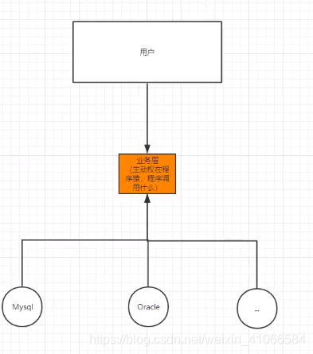

经过控制反转之后

创建对象的主动权在用户层上

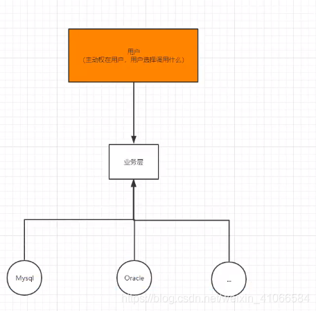

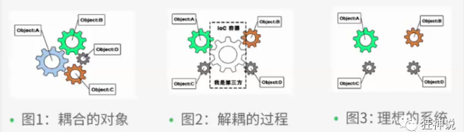

IOC是Spring框架的核心内容，使用多种方式完美的实现了IOC，可以使用XML配置，也可以使用注解，新版本的Spring也可以零配置实现IOC。

Spring容器在初始化时先读取配置文件，根据配置文件或元数据创建与组织对象存入容器中，程序使用时再从IOC容器中取出需要的对象。

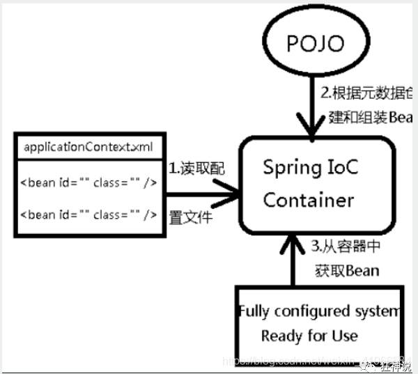

采用XML方式配置Bean的时候，Bean的定义信息是和实现分离的，而采用注解的方式可以把两者合为一体，Bean的定义信息直接以注解的形式定义在实现类中，从而达到了零配置的目的。

控制反转是一种通过描述（XML或注解）并通过第三方去生产或获取特定对象的方式。在Spring中实现控制反转的是IOC容器，其实现方法是依赖注入（Dependency Injection,DI）。

### 依赖注入

依赖注入 DI（Dependency Injection）。

- 依赖 : 指Bean对象的创建依赖于容器 . Bean对象的依赖资源 .
- 注入 : 指Bean对象所依赖的资源 , 由容器来设置和装配 .

#### 构造器注入

##### 通过无参构造来创建

1、User.java

```java
public class User {
 
    private String name;
 
    public User() {
        System.out.println("user无参构造方法");
    }
 
    public void setName(String name) {
        this.name = name;
    }
 
    public void show(){
        System.out.println("name="+ name );
    }
 
}
```


2、beans.xml

```xml
<?xml version="1.0" encoding="UTF-8"?>
<beans xmlns="http://www.springframework.org/schema/beans"
       xmlns:xsi="http://www.w3.org/2001/XMLSchema-instance"
       xsi:schemaLocation="http://www.springframework.org/schema/beans
        http://www.springframework.org/schema/beans/spring-beans.xsd">
 
    <bean id="user" class="com.kuang.pojo.User">
        <property name="name" value="kuangshen"/>
    </bean>
 
</beans>
```


3、测试类

```java
@Test
public void test(){
    ApplicationContext context = new ClassPathXmlApplicationContext("beans.xml");
    //在执行getBean的时候, user已经创建好了 , 通过无参构造
    User user = (User) context.getBean("user");
    //调用对象的方法 .
    user.show();
}
```

- 结果可以发现，在调用show方法之前，User对象已经通过无参构造初始化了！

##### 通过有参构造方法来创建

将无参构造更改为有参构造

```java
public UserT(String name) {
	this.name = name;
}
```

2、beans.xml 有三种方式编写

```java
<!-- 第一种根据index参数下标设置 -->
<bean id="userT" class="com.kuang.pojo.UserT">
    <!-- index指构造方法 , 下标从0开始 -->
    <constructor-arg index="0" value="kuangshen2"/>
</bean>
 
<!-- 第二种根据参数名字设置 -->
<bean id="userT" class="com.kuang.pojo.UserT">
    <!-- name指参数名 -->
    <constructor-arg name="name" value="kuangshen2"/>
</bean>
 
<!-- 第三种根据参数类型设置 -->
<bean id="userT" class="com.kuang.pojo.UserT">
    <constructor-arg type="java.lang.String" value="kuangshen2"/>
</bean>
```

ref 引用Spring 容器中创建好的对象

value 具体的值，基本数据类型

3、测试

```java
@Test
public void testT(){
    ApplicationContext context = new ClassPathXmlApplicationContext("beans.xml");
    UserT user = (UserT) context.getBean("userT");
    user.show();
}
```

结论：在配置文件加载的时候。其中管理的对象都已经初始化了！

tips：构造器注入有循环依赖的问题

#### set注入

环境搭建

Address类

```java
package com.kuang.pojo;
 
public class Address {
    private String address;
 
    public Address(String address) {
        this.address = address;
    }
 
    public String getAddress() {
        return address;
    }
 
    public void setAddress(String address) {
        this.address = address;
    }
}
```

Student类

```java
package com.kuang.pojo;
 
import java.util.*;
 
public class Student {
    private String name;
    private Address address;
    private String[] books;
    private Map<String,String> card;
    private Set<String> games;
    private List<String> hobbys;
    private Properties info;
    private String wife;
 
    @Override
    public String toString() {
        return "Student{" +
                "name='" + name + '\'' +
                ", address=" + address +
                ", books=" + Arrays.toString(books) +
                ", card=" + card +
                ", games=" + games +
                ", hobbys=" + hobbys +
                ", info=" + info +
                ", wife='" + wife + '\'' +
                '}';
    }
 
    public String getName() {
        return name;
    }
 
    public void setName(String name) {
        this.name = name;
    }
 
    public Address getAddress() {
        return address;
    }
 
    public void setAddress(Address address) {
        this.address = address;
    }
 
    public String[] getBooks() {
        return books;
    }
 
    public void setBooks(String[] books) {
        this.books = books;
    }
 
    public Map<String, String> getCard() {
        return card;
    }
 
    public void setCard(Map<String, String> card) {
        this.card = card;
    }
 
    public Set<String> getGames() {
        return games;
    }
 
    public void setGames(Set<String> games) {
        this.games = games;
    }
 
    public List<String> getHobbys() {
        return hobbys;
    }
 
    public void setHobbys(List<String> hobbys) {
        this.hobbys = hobbys;
    }
 
    public Properties getInfo() {
        return info;
    }
 
    public void setInfo(Properties info) {
        this.info = info;
    }
 
    public String getWife() {
        return wife;
    }
 
    public void setWife(String wife) {
        this.wife = wife;
    }
}
```

beans.xml

```xml
<?xml version="1.0" encoding="UTF-8"?>
<beans xmlns="http://www.springframework.org/schema/beans"
       xmlns:xsi="http://www.w3.org/2001/XMLSchema-instance"
       xsi:schemaLocation="http://www.springframework.org/schema/beans
       http://www.springframework.org/schema/beans/spring-beans.xsd">
</beans>
```

- 常量注入

```xml
<bean id="Student" class="com.kuang.pojo.Student">
    <!--第一种，普通值注入，value-->
    <property name="name" value="kuangshen"></property>
</bean>
```

- 数组注入

```xml
<property name="books">
            <array>
                <value>红楼梦</value>
                <value>西游记</value>
                <value>水浒传</value>
                <value>三国演义</value>
            </array>
</property>
```

- 列表注入

```xml
<property name="hobbys">
            <list>
                <value>听歌</value>
                <value>敲代码</value>
                <value>看电影</value>
            </list>
 </property>
```

- map注入

```xml
<property name="card">
            <map>
                <entry key="身份证" value="11111111"/>
                <entry key="银行卡" value="11111111"/>
            </map>
</property>
```

- set注入

```xml
<property name="games">
            <set>
                <value>LOL</value>
                <value>COC</value>
                <value>WOW</value>
            </set>
</property>
```

- null注入

```xml
<property name="wife">
            <null/>
        </property>
```

- properties注入

```xml
<property name="info">
            <props>
                <prop key="学号">2019929</prop>
                <prop key="性别">男</prop>
                <prop key="username">kuangshen</prop>
            </props>
        </property>
```

完善注入信息

- 拓展方式注入

p命名和c命名不能直接使用，需要在头部导入xml约束

```xml
<beans xmlns="http://www.springframework.org/schema/beans"
       xmlns:xsi="http://www.w3.org/2001/XMLSchema-instance"
       xmlns:p="http://www.springframework.org/schema/p"
       xmlns:c="http://www.springframework.org/schema/c"
       xsi:schemaLocation="http://www.springframework.org/schema/beans
    https://www.springframework.org/schema/beans/spring-beans.xsd">
</beans>
```

```xml
xmlns:p="http://www.springframework.org/schema/p"
xmlns:c="http://www.springframework.org/schema/c"
```

```java
package com.kuang.pojo;
 
public class User02 {
    private int id;
    private String name;
    private int age;
 
    public User02() {
    }
 
    public User02(int id, String name, int age) {
        this.id = id;
        this.name = name;
        this.age = age;
    }
 
    public int getId() {
        return id;
    }
 
    public void setId(int id) {
        this.id = id;
    }
 
    public String getName() {
        return name;
    }
 
    public void setName(String name) {
        this.name = name;
    }
 
    public int getAge() {
        return age;
    }
 
    public void setAge(int age) {
        this.age = age;
    }
}
```

p命名注入 property

```xml
<!-- p命名空间注入，可以直接注入属性的值：property -->
<bean id="User"  class="com.kuang.pojo.User" p:name ="老秦" p:age ="18"/>
```


c命名空间注入 constructor

```xml
<!-- c命名空间注入，通过构造器注入：construct-args -->
<bean id="User2" class="com.kuang.pojo.User" c:age="18" c:name="老李"/>
```

注意点：p命名和c命名不能直接使用，需要导入xml约束


## Spring 配置

### 别名

```xml
<!--  别名 : 如果添加了别名，我们也可以使用别名获取到这个对象 -->
<alias name="User" alias="u1"></alias>
```

### Bean的配置

```java
<!--
  id : bean的唯一标识符，相当于类名
  class : bean 对象所对应的完全限定名：包名 + 类型
  name : 也是别名,而且name更高级，可以取多个，而且有多个分隔符
  -->
<bean id="UserT" class="com.kuang.pojo.UserT" name="u2 u21,u22;u23">
    <property name="name" value="123"/>
</bean>
```

### import

团队的合作通过import来实现 .

```xml
<import resource="beans.xml"/>
```

能将多个人开发的不同的配置xml文件整合到applicationContext.xml文件中，并且能够合适的去重。

## Bean的自动装配

自动装配是使用spring满足bean依赖的一种方法
spring会在应用上下文中为某个bean寻找其依赖的bean。
Spring中bean有三种装配机制，分别是：

1. 在xml中显式配置
2. 在java中显式配置
3. 隐式的bean发现机制和自动装配

这里我们主要讲第三种：自动化的装配bean。

Spring的自动装配需要从两个角度来实现，或者说是两个操作：

组件扫描(component scanning)：spring会自动发现应用上下文中所创建的bean；
自动装配(autowiring)：spring自动满足bean之间的依赖，也就是我们说的IOC/DI；
组件扫描和自动装配组合发挥巨大威力，使得显示的配置降低到最少。

推荐不使用自动装配xml配置 , 而使用注解 .

1 搭建环境

一个人两个宠物

传统装配

```xml
<bean id="cat" class="com.kuang.pojo.Cat"/>
    <bean id="dog" class="com.kuang.pojo.Dog"/>
    <bean id="person" class="com.kuang.pojo.Person">
        <property name="name" value="小狂神啊"/>
        <property name="dog" ref="dog"/>
        <property name="cat" ref="cat"/>
    </bean>
```


### byName自动装配

byName 会自动在容器上下文中查找，和自己对象set方法后面的值 对应的bean id

```xml
<bean id="cat" class="com.kuang.pojo.Cat"/>
    <bean id="dog" class="com.kuang.pojo.Dog"/>
    <bean id="person" class="com.kuang.pojo.Person" autowire="byName">
        <property name="name" value="小狂神啊"/>
        
    </bean>
```

如果我们将 cat 的bean id修改为 catXXX

再次测试， 执行时报空指针java.lang.NullPointerException。因为按byName规则找不对应set方法，真正的setCat就没执行，对象就没有初始化，所以调用时就会报空指针错误。一定要注意对应宠物的bean id 一定改成小写开头的

当一个bean节点带有 autowire byName的属性时。

1. 将查找其类中所有的set方法名，例如setCat，获得将set去掉并且首字母小写的字符串，即cat。
2. 去spring容器中寻找是否有此字符串名称id的对象。
3. 如果有，就取出注入；如果没有，就报空指针异常。


### byType自动装配

```xml
<bean id="cat" class="com.kuang.pojo.Cat"/>
    <bean id="dog" class="com.kuang.pojo.Dog"/>
    <bean id="person" class="com.kuang.pojo.Person" autowire="byType">
        <property name="name" value="小狂神啊"/>
        
    </bean>
```


byType 会自动在容器上下文中查找，和自己对象属性相同的值对应的Bean id

- byName: 需要保证所有的bean的id唯一，并且这个bean需要和自动注入的属性的set的方法的值一致！
- byType: 需要保证所有的bean的class唯一，并且这个bean需要和自动注入的属性的类型一致！


### 使用注解实现自动装配

要使用注解

1.导入约束

context约束

2.配置注解的支持

 <context:annotation-config/>【重要】


```xml
<?xml version="1.0" encoding="UTF-8"?>
<beans xmlns="http://www.springframework.org/schema/beans"
    xmlns:xsi="http://www.w3.org/2001/XMLSchema-instance"
    xmlns:context="http://www.springframework.org/schema/context"
    xsi:schemaLocation="http://www.springframework.org/schema/beans
        https://www.springframework.org/schema/beans/spring-beans.xsd
        http://www.springframework.org/schema/context
        https://www.springframework.org/schema/context/spring-context.xsd">
 
    <context:annotation-config/>
</beans>
```


**@Autowired**

@Autowired是按类型自动转配的，不支持id匹配。byType
需要导入 spring-aop的包！
直接在属性上使用即可！也可以在set方式上使用！

使用Autowired我们可以不用编写Set方法了，前提是这个自动装配的属性在IOC容器中存在，且符合名字byname。

```java
 @Autowired
    private Cat cat;
    @Autowired
    private Dog dog;
```

```java
@Nullable     // 字段标记了这个注解，说明这个字段可以为null
```


或者 如果显示定义了Autowired的required 的属性为false ，说明这个对象可以为null，允许为空

 

autowired 注解应该是只能是别的，当注入 在IOC容器中该类型只有一个时，就通过byType进行装配，当注入容器存在多个同意类型的对象是，就是根据byName进行装配

如果@Autowired自动装配的环境比较复杂，自动装配无法通过一个注解[@Autowired]完成的时候，我们可以使用@Qualifier(value=“XXX”)去配置@Autowired的使用，指定一个唯一的bean对象注入。

**@Qualifier**

@Autowired是根据类型自动装配的，加上@Qualifier则可以根据byName的方式自动装配
@Qualifier不能单独使用。

```java
public class People {
    private String name;
    @Autowired
    @Qualifier("cat")
    private Cat cat;
    @Autowired
    @Qualifier("dog")
    private Dog dog;
}
```


**@Resource注解**

- @Resource如有指定的name属性，先按该属性进行byName方式查找装配；
- 其次再进行默认的byName方式进行装配；
- 如果以上都不成功，则按byType的方式自动装配。
- 都不成功，则报异常。


```java
public class People {
    private String name;
    @Resource(name = "cat")
    private Cat cat;
    @Resource(name = "dog")
    private Dog dog;
```


### @Autowired与@Resource异同

@Autowired与@Resource都可以用来装配bean。都可以写在字段上，或写在setter方法上。

@Autowired默认按类型装配（属于spring规范），默认情况下必须要求依赖对象必须存在，如果要允许null 值，可以设置它的required属性为false，如：@Autowired(required=false) ，如果我们想使用名称装配可以结合@Qualifier注解进行使用

@Resource（属于J2EE复返），默认按照名称进行装配，名称可以通过name属性进行指定。如果没有指定name属性，当注解写在字段上时，默认取字段名进行按照名称查找，如果注解写在setter方法上默认取属性名进行装配。当找不到与名称匹配的bean时才按照类型进行装配。但是 需要注意的是，如果name属性一旦指定，就只会按照名称进行装配。

它们的作用相同都是用注解方式注入对象，但执行顺序不同。@Autowired先byType，@Resource先byName。

## 使用注解开发

### 说明

在spring4之后，想要使用注解形式，必须得要引入aop的包

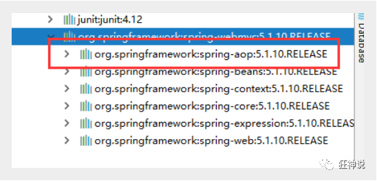

在配置文件当中，还得要引入一个context约束

```xml
<?xml version="1.0" encoding="UTF-8"?>
<beans xmlns="http://www.springframework.org/schema/beans"
       xmlns:xsi="http://www.w3.org/2001/XMLSchema-instance"
       xmlns:context="http://www.springframework.org/schema/context"
       xsi:schemaLocation="http://www.springframework.org/schema/beans
        http://www.springframework.org/schema/beans/spring-beans.xsd
        http://www.springframework.org/schema/context
        http://www.springframework.org/schema/context/spring-context.xsd">
 
</beans>
```

在指定包下编写类，增加注解

```java
@Component("user")
// 相当于配置文件中 <bean id="user" class="当前注解的类"/>
public class User {
    public String name = "秦疆";
}
```

测试

```java
@Test
public void test(){
    ApplicationContext applicationContext =
        new ClassPathXmlApplicationContext("beans.xml");
    User user = (User) applicationContext.getBean("user");
    System.out.println(user.name);
}
```

### Bean的实现

我们之前都是使用 bean 的标签进行bean注入，但是实际开发中，我们一般都会使用注解！

1、配置扫描哪些包下的注解

```xml
<!--指定注解扫描包-->
<context:component-scan base-package="com.kuang.pojo"/>
```


### 属性注入

使用注解注入属性

1、可以不用提供set方法，直接在直接名上添加@value(“值”)

```java
@Component("user")
// 相当于配置文件中 <bean id="user" class="当前注解的类"/>
public class User {
    @Value("秦疆")
    // 相当于配置文件中 <property name="name" value="秦疆"/>
    public String name;
}
```


2、如果提供了set方法，在set方法上添加@value(“值”);

```java
@Component("user")
public class User {
 
    public String name;
 
    @Value("秦疆")
    public void setName(String name) {
        this.name = name;
    }
}
```

### 衍生注解

我们这些注解，就是替代了在配置文件当中配置步骤而已！更加的方便快捷！

@Component三个衍生注解

为了更好的进行分层，Spring可以使用其它三个注解，功能一样，目前使用哪一个功能都一样。

@Controller：web层
@Service：service层
@Repository：dao层
写上这些注解，就相当于将这个类交给Spring管理装配了！

自动装配注解

在Bean的自动装配已经讲过了，可以回顾！

作用域

@scope

singleton：默认的，Spring会采用单例模式创建这个对象。关闭工厂 ，所有的对象都会销毁。
prototype：多例模式。关闭工厂 ，所有的对象不会销毁。内部的垃圾回收机制会回收。

```java
@Controller("user")
@Scope("prototype")
public class User {
    @Value("秦疆")
    public String name;
}
```

​	**小结**

**XML与注解比较**

- XML可以适用任何场景 ，结构清晰，维护方便
- 注解不是自己提供的类使用不了，开发简单方便

**xml与注解整合开发** ：推荐最佳实践

- xml管理Bean
- 注解完成属性注入
- 使用过程中， 可以不用扫描，扫描是为了类上的注解

```xml
<context:annotation-config/>  
```


作用：

- 进行注解驱动注册，从而使注解生效
- 用于激活那些已经在spring容器里注册过的bean上面的注解，也就是显示的向Spring注册
- 如果不扫描包，就需要手动配置bean
- 如果不加注解驱动，则注入的值为null！

### 使用java的方式配置Spring

我们现在要完全不使用spring的xml配置，全权交给java来做。

实体类User

```java
package com.kuang.pojo;
 
import org.springframework.beans.factory.annotation.Value;
import org.springframework.stereotype.Controller;
// 这里的这个注解的意思，就是说明这个类被Spring托管了，注册到了容器中
@Controller
public class User {
    // 属性的注入
    @Value("qingjiang")
    private String name;
 
    public String getName() {
        return name;
    }
 
    public void setName(String name) {
        this.name = name;
    }
 
    @Override
    public String toString() {
        return "User{" +
                "name='" + name + '\'' +
                '}';
    }
}
```

配置类

```java
package com.kuang.config;
 
import com.kuang.pojo.User;
import org.springframework.context.annotation.*;
 
// @Configuration本质上也是一个Controller，也会被spring托管，注册到容器中
// @Configuration表示这是一个配置类，和之前的beans.xml的功能一样的
 
@Configuration
@ComponentScan("com.kuang.pojo")        // @ComponentScan表示组件的扫描
@Import(MyConfig1.class)                 // 通过import导入其他的配置类
public class MyConfig {
    // @Bean 表示注册一个bean
    // 方法的名字即是bean中的id
    // 方法的返回值就是bean中的class
    @Bean
    public User getUser(){
        return new User();      // return就是返回要注入到bean中的对象
    }
 
}
```

测试类

```java
import com.kuang.config.MyConfig;
import com.kuang.pojo.User;
import org.junit.Test;
import org.springframework.context.ApplicationContext;
import org.springframework.context.annotation.AnnotationConfigApplicationContext;
 
public class MyTest {
    @Test
    public void test(){
        // 如果使用了java配置类的方式来注册bean，
        // 只能通过AnnotationConfig上下文来获取容器，通过配置类的class对象加载！
        ApplicationContext context = new AnnotationConfigApplicationContext(MyConfig.class);
        // 获取通过配置类中的方法getUser方法来获得的User对象
        User user = (User) context.getBean("getUser");
        System.out.println(user.toString());
    }
}
```

- 这种纯java配置方式，在SpringBoot中随处可见！

```java
@Component 
```

这里这个注解的意思就是说明这个类被Spring接管了，注册到了容器中

@Configuration本质上还是一个@Component，代表这个一个配置类和bean.xml一样

@ComponentScan("com.kuang.pojo") // @ComponentScan表示组件的扫描 @Import(MyConfig1.class) // 通过import导入其他的配置类

## 代理模式

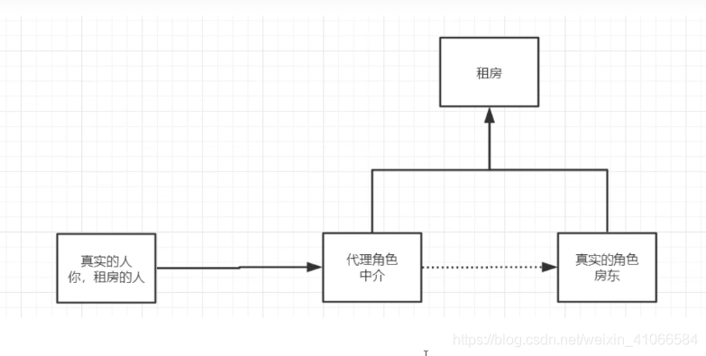


代理模式：

- 静态代理
- 动态代理


### 静态代理

角色分析

抽象角色 : 一般使用接口或者抽象类来实现

真实角色 : 被代理的角色

代理角色 : 代理真实角色 ; 代理真实角色后 , 一般会做一些附属的操作 

客户 : 使用代理角色来进行一些操作 

 

rent接口

```java
package com.kuang.Daili;
 
public interface Rent {
    public void rent();
}
```

Client租户

```java
package com.kuang.Daili;
 
public class Client {
    public static void main(String[] args) {
        Host host=new Host();
        //host.rent();
        Proxy proxy=new Proxy(host);
 
        proxy.rent();
    }
}
```

proxy代理角色

```java
package com.kuang.Daili;
 
public class Proxy {
    private Host host;
    public Proxy(){
 
    }
    public Proxy(Host host){
        this.host=host;
    }
    public void rent(){
        seeHouse();
 
        host.rent();
        hetong();
        fare();
    }
    public void seeHouse(){
        System.out.println("中介带你看房");
    }
    public void fare(){
        System.out.println("收中介费!");
    }
    public void hetong(){
        System.out.println("签租领合同");
    } 
 
}
```

房东

```java
package com.kuang.Daili;
 
public class Host implements Rent{
    @Override
    public void rent() {
        System.out.println("房东出租房子！");
    }
}
```

分析：在这个过程中，你直接接触的就是中介，就如同现实生活中的样子，你看不到房东，但是你依旧租到了房东的房子通过代理，这就是所谓的代理模式，程序源自于生活，所以学编程的人，一般能够更加抽象的看待生活中发生的事情


静态代理的好处:

- 可以使得我们的真实角色更加纯粹 . 不再去关注一些公共的事情 
- 公共的业务由代理来完成 . 实现了业务的分工 
- 公共业务发生扩展时变得更加集中和方便 


缺点 :

- 类多了 , 多了代理类 , 工作量变大了,开发效率降低,我们想要静态代理的好处，又不想要静态代理的缺点，所以 , 就有了动态代理

  

代码步骤:

- 接口
- 真实角色
- 代理角色
- 客户端访问代理角色


### 静态代理的再理解

1、创建一个抽象角色，比如咋们平时做的用户业务，抽象起来就是增删改查！

```java
//抽象角色：增删改查业务
public interface UserService {
    void add();
    void delete();
    void update();
    void query();
}
```

2、我们需要一个真实对象来完成这些增删改查操作

```java
//真实对象，完成增删改查操作的人
public class UserServiceImpl implements UserService {
 
    public void add() {
        System.out.println("增加了一个用户");
    }
 
    public void delete() {
        System.out.println("删除了一个用户");
    }
 
    public void update() {
        System.out.println("更新了一个用户");
    }
 
    public void query() {
        System.out.println("查询了一个用户");
    }
}
```

3、需求来了，现在我们需要增加一个日志功能，怎么实现！

- 思路1 ：在实现类上增加代码 【麻烦！】
- 思路2：使用代理来做，能够不改变原来的业务情况下，实现此功能就是最好的了！


4、设置一个代理类来处理日志！代理角色

```java
//代理角色，在这里面增加日志的实现
public class UserServiceProxy implements UserService {
    private UserServiceImpl userService;
 
    public void setUserService(UserServiceImpl userService) {
        this.userService = userService;
    }
 
    public void add() {
        log("add");
        userService.add();
    }
 
    public void delete() {
        log("delete");
        userService.delete();
    }
 
    public void update() {
        log("update");
        userService.update();
    }
 
    public void query() {
        log("query");
        userService.query();
    }
 
    public void log(String msg){
        System.out.println("执行了"+msg+"方法");
    }
 
}
```

OK，到了现在代理模式大家应该都没有什么问题了，重点大家需要理解其中的思想；我们在不改变原来的代码的情况下，实现了对原有功能的增强，这是AOP中最核心的思想


### 动态代理

动态代理的角色和静态代理的一样 .

动态代理的代理类是动态生成的 . 静态代理的代理类是我们提前写好的

动态代理分为两类 : 一类是基于接口动态代理 , 一类是基于类的动态代理

基于接口的动态代理----JDK动态代理
基于类的动态代理–cglib
现在用的比较多的是 javasist 来生成动态代理 . 百度一下javasist
我们这里使用JDK的原生代码来实现，其余的道理都是一样的！

#### JDK的动态代理需要了解两个类

核心 : InvocationHandler 和 Proxy ， 打开JDK帮助文档看看

【InvocationHandler：调用处理程序】

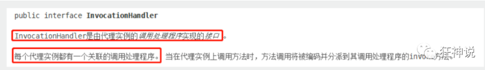


```java
Object invoke(Object proxy, 方法 method, Object[] args)；
//参数
//proxy - 调用该方法的代理实例
//method -所述方法对应于调用代理实例上的接口方法的实例。方法对象的声明类将是该方法声明的接口，它可以是代理类继承该方法的代理接口的超级接口。
//args -包含的方法调用传递代理实例的参数值的对象的阵列，或null如果接口方法没有参数。原始类型的参数包含在适当的原始包装器类的实例中，例如java.lang.Integer或java.lang.Boolean 。
```


【Proxy : 代理】

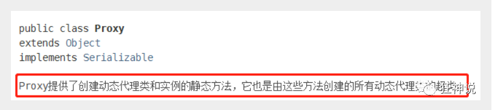


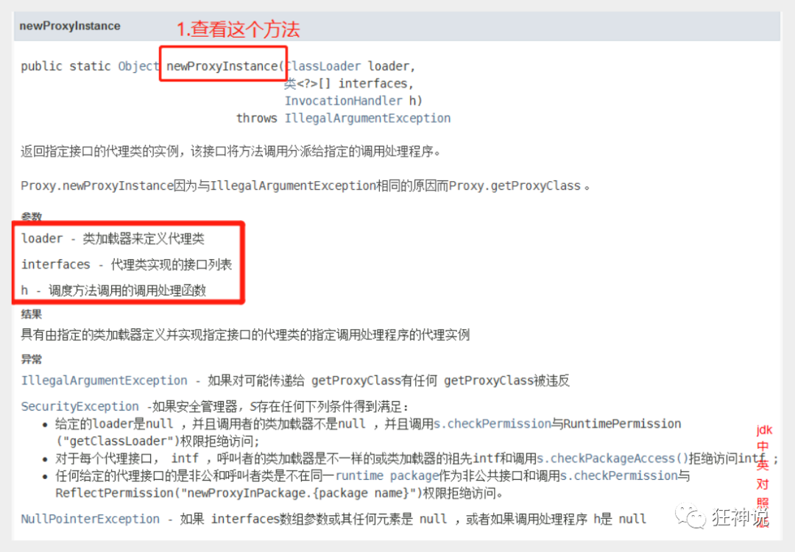


```java
//生成代理类
public Object getProxy(){
    return Proxy.newProxyInstance(this.getClass().getClassLoader(),
                                  rent.getClass().getInterfaces(),this);
}
```

**代码实现**

抽象角色和真实角色和之前的一样！

Rent . java 即抽象角色

```java
//抽象角色：租房
public interface Rent {
    public void rent();
}
```


Host . java 即真实角色

```java
//真实角色: 房东，房东要出租房子
public class Host implements Rent{
    public void rent() {
        System.out.println("房屋出租");
    }
}
```

ProxyInvocationHandler. java 即代理角色

```java
public class ProxyInvocationHandler implements InvocationHandler {
    private Rent rent;
 
    public void setRent(Rent rent) {
        this.rent = rent;
    }
 
    //生成代理类，重点是第二个参数，获取要代理的抽象角色！之前都是一个角色，现在可以代理一类角色
    public Object getProxy(){
        return Proxy.newProxyInstance(this.getClass().getClassLoader(),
                rent.getClass().getInterfaces(),this);
    }
 
    // proxy : 代理类 method : 代理类的调用处理程序的方法对象.
    // 处理代理实例上的方法调用并返回结果
    @Override
    public Object invoke(Object proxy, Method method, Object[] args) throws Throwable {
        seeHouse();
        //核心：本质利用反射实现！
        Object result = method.invoke(rent, args);
        fare();
        return result;
    }
 
    //看房
    public void seeHouse(){
        System.out.println("带房客看房");
    }
    //收中介费
    public void fare(){
        System.out.println("收中介费");
    }
 
}
```

- Client . java

```java
//租客
public class Client {
 
    public static void main(String[] args) {
        //真实角色
        Host host = new Host();
        //代理实例的调用处理程序
        ProxyInvocationHandler pih = new ProxyInvocationHandler();
        pih.setRent(host); //将真实角色放置进去！
        Rent proxy = (Rent)pih.getProxy(); //动态生成对应的代理类！
        proxy.rent();
    }
 
}
```

核心：**一个动态代理 , 一般代理某一类业务 , 一个动态代理可以代理多个类，代理的是接口！**


#### 编写一个通用代理工具类：

```java
public class ProxyInvocationHandler implements InvocationHandler {
    private Object target;
 
    public void setTarget(Object target) {
        this.target = target;//得到真实角色
    }
 
    //生成代理类
    public Object getProxy(){
        return Proxy.newProxyInstance(this.getClass().getClassLoader(),
                target.getClass().getInterfaces(),this);
    }
 
    // proxy : 代理类
    // method : 代理类的调用处理程序的方法对象.
    public Object invoke(Object proxy, Method method, Object[] args) throws Throwable {
        log(method.getName());
        Object result = method.invoke(target, args);
        return result;
    }
 
    public void log(String methodName){
        System.out.println("执行了"+methodName+"方法");
    }
 
}
```


测试！

```java
public class Test {
    public static void main(String[] args) {
        //真实对象
        UserServiceImpl userService = new UserServiceImpl();
        //代理对象的调用处理程序
        ProxyInvocationHandler pih = new ProxyInvocationHandler();
        pih.setTarget(userService); //设置要代理的对象
        UserService proxy = (UserService)pih.getProxy(); //动态生成代理类！
        proxy.delete();
    }
}
```

- 测试，增删改查，查看结果！


动态代理，由于静态代理需要给每一个实体类创建一个代理类，实现静态代理。这样做的缺点就是让代码量变得异常多，所以产生了动态代理。

我们的目标是生成代理类，接口拥有代理对象和目标对象共同的类信息。所以动态代理可以看作是通过接口生成一个新的代理类

## AOP

### 什么是AOP

AOP（Aspect Oriented Programming）意为：面向切面编程，通过预编译方式和运行期动态代理实现程序功能的统一维护的一种技术。AOP是OOP的延续，是软件开发中的一个热点，也是Spring框架中的一个重要内容，是函数式编程的一种衍生范型。利用AOP可以对业务逻辑的各个部分进行隔离，从而使得业务逻辑各部分之间的耦合度降低，提高程序的可重用性，同时提高了开发的效率。

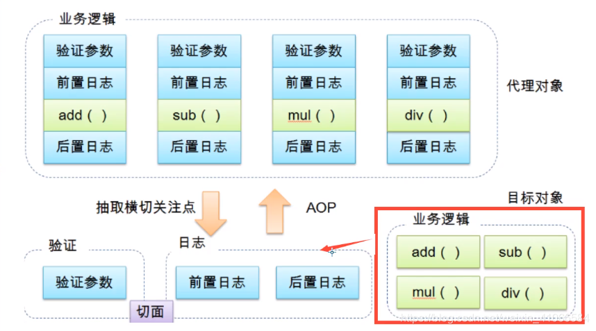

### Aop在Spring中的作用

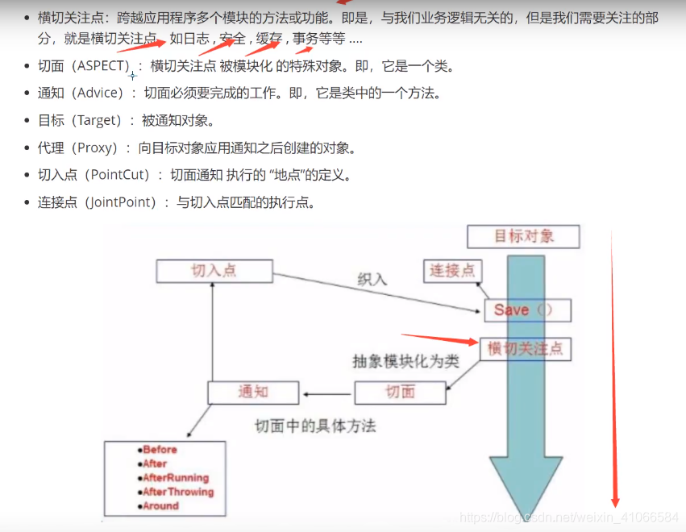

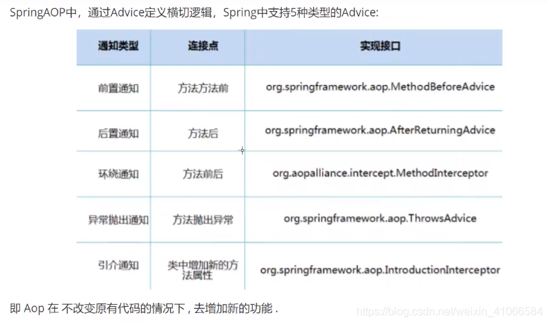


**即 Aop 在 不改变原有代码的情况下 , 去增加新的功能 .**

### 使用Spring实现Aop

【重点】使用AOP织入，需要导入一个依赖包！

```xml
<!-- https://mvnrepository.com/artifact/org.aspectj/aspectjweaver -->
<dependency>
    <groupId>org.aspectj</groupId>
    <artifactId>aspectjweaver</artifactId>
    <version>1.9.4</version>
</dependency>
```

#### 第一种方式

**通过 Spring API 实现**

首先编写我们的业务接口和实现类

```java
public interface UserService {
 
    public void add();
 
    public void delete();
 
    public void update();
 
    public void search();
 
} 
```

```java
public class UserServiceImpl implements UserService{
 
    @Override
    public void add() {
        System.out.println("增加用户");
    }
 
    @Override
    public void delete() {
        System.out.println("删除用户");
    }
 
    @Override
    public void update() {
        System.out.println("更新用户");
    }
 
    @Override
    public void search() {
        System.out.println("查询用户");
    }
}
```

然后去写我们的增强类 , 我们编写两个 , 一个前置增强 一个后置增强

```java
public class Log implements MethodBeforeAdvice {
 
    //method : 要执行的目标对象的方法
    //objects : 被调用的方法的参数
    //Object : 目标对象
    @Override
    public void before(Method method, Object[] objects, Object o) throws Throwable {
        System.out.println( o.getClass().getName() + "的" + method.getName() + "方法被执行了");
    }
}
```

```java
public class AfterLog implements AfterReturningAdvice {
    //returnValue 返回值
    //method被调用的方法
    //args 被调用的方法的对象的参数
    //target 被调用的目标对象
    @Override
    public void afterReturning(Object returnValue, Method method, Object[] args, Object target) throws Throwable {
        System.out.println("执行了" + target.getClass().getName()
        +"的"+method.getName()+"方法,"
        +"返回值："+returnValue);
    }
}
```

最后去spring的文件中注册 , 并实现aop切入实现 , 注意导入约束 .

```xml
<?xml version="1.0" encoding="UTF-8"?>
<beans xmlns="http://www.springframework.org/schema/beans"
       xmlns:xsi="http://www.w3.org/2001/XMLSchema-instance"
       xmlns:aop="http://www.springframework.org/schema/aop"
       xsi:schemaLocation="http://www.springframework.org/schema/beans
        http://www.springframework.org/schema/beans/spring-beans.xsd
        http://www.springframework.org/schema/aop
        http://www.springframework.org/schema/aop/spring-aop.xsd">
 
    <!--注册bean-->
    <bean id="userService" class="com.kuang.service.UserServiceImpl"/>
    <bean id="log" class="com.kuang.log.Log"/>
    <bean id="afterLog" class="com.kuang.log.AfterLog"/>
 
    <!--aop的配置-->
    <aop:config>
        <!--切入点  expression:表达式匹配要执行的方法-->
        <aop:pointcut id="pointcut" expression="execution(* com.kuang.service.UserServiceImpl.*(..))"/>
        <!--执行环绕; advice-ref执行方法 . pointcut-ref切入点-->
        <aop:advisor advice-ref="log" pointcut-ref="pointcut"/>
        <aop:advisor advice-ref="afterLog" pointcut-ref="pointcut"/>
    </aop:config>
 
</beans>
```


测试

```java
public class MyTest {
    @Test
    public void test(){
        ApplicationContext context = new ClassPathXmlApplicationContext("beans.xml");
        UserService userService = (UserService) context.getBean("userService");
        userService.search();
    }
}
```

Aop的重要性 : 很重要,一定要理解其中的思路 , 主要是思想的理解这一块

Spring的Aop就是将公共的业务 (日志 , 安全等) 和领域业务结合起来 , 当执行领域业务时 , 将会把公共业务加进来 . 实现公共业务的重复利用 . 领域业务更纯粹 , 程序猿专注领域业务 , 其本质还是动态代理 

Aop的重要性 : 很重要 . 一定要理解其中的思路 , 主要是思想的理解这一块 

Spring的Aop就是将公共的业务 (日志 , 安全等) 和领域业务结合起来 , 当执行领域业务时 , 将会把公共业务加进来 . 实现公共业务的重复利用 . 领域业务更纯粹 , 程序猿专注领域业务 , 其本质还是动态代理 

#### 第二种方式

**自定义类来实现Aop**

**主要是切面**

目标业务类不变依旧是userServiceImpl

第一步 : 写我们自己的一个切入类

```java
public class DiyPointcut {
 
    public void before(){
        System.out.println("---------方法执行前---------");
    }
    public void after(){
        System.out.println("---------方法执行后---------");
    }
    
}
```

- 去spring中配置

```xml
<!--第二种方式自定义实现-->
<!--注册bean-->
<bean id="diy" class="com.kuang.config.DiyPointcut"/>
 
<!--aop的配置-->
<aop:config>
    <!--第二种方式：使用AOP的标签实现-->
    <aop:aspect ref="diy">
        <aop:pointcut id="diyPonitcut" expression="execution(* com.kuang.service.UserServiceImpl.*(..))"/>
        <aop:before pointcut-ref="diyPonitcut" method="before"/>
        <aop:after pointcut-ref="diyPonitcut" method="after"/>
    </aop:aspect>
</aop:config>
```

测试：

```java
public class MyTest {
    @Test
    public void test(){
        ApplicationContext context = new ClassPathXmlApplicationContext("beans.xml");
        UserService userService = (UserService) context.getBean("userService");
        userService.add();
    }
}
```

#### 第三种方式

**使用注解实现AOP**

第一步：编写一个注解实现的增强类


```java
package com.kuang.config;
 
import org.aspectj.lang.ProceedingJoinPoint;
import org.aspectj.lang.annotation.After;
import org.aspectj.lang.annotation.Around;
import org.aspectj.lang.annotation.Aspect;
import org.aspectj.lang.annotation.Before;
 
@Aspect
public class AnnotationPointcut {
    @Before("execution(* com.kuang.service.UserServiceImpl.*(..))")
    public void before(){
        System.out.println("---------方法执行前---------");
    }
 
    @After("execution(* com.kuang.service.UserServiceImpl.*(..))")
    public void after(){
        System.out.println("---------方法执行后---------");
    }
 
    @Around("execution(* com.kuang.service.UserServiceImpl.*(..))")
    public void around(ProceedingJoinPoint jp) throws Throwable {
        System.out.println("环绕前");
        System.out.println("签名:"+jp.getSignature());
        //执行目标方法proceed
        Object proceed = jp.proceed();
        System.out.println("环绕后");
        System.out.println(proceed);
    }
}
```

第二步：在Spring配置文件中，注册bean，并增加支持注解的配置

```xml
<!--第三种方式:注解实现-->
<bean id="annotationPointcut" class="com.kuang.config.AnnotationPointcut"/>
<aop:aspectj-autoproxy/>
```

aop:aspectj-autoproxy：说明

```xml
通过aop命名空间的<aop:aspectj-autoproxy />声明自动为spring容器中那些配置@aspectJ切面的bean创建代理，织入切面。当然，spring 在内部依旧采用AnnotationAwareAspectJAutoProxyCreator进行自动代理的创建工作，但具体实现的细节已经被<aop:aspectj-autoproxy />隐藏起来了
 
<aop:aspectj-autoproxy />有一个proxy-target-class属性，默认为false，表示使用jdk动态代理织入增强，当配为<aop:aspectj-autoproxy  poxy-target-class="true"/>时，表示使用CGLib动态代理技术织入增强。不过即使proxy-target-class设置为false，如果目标类没有声明接口，则spring将自动使用CGLib动态代理。
```

## 声明式事物

### 事物的回顾

事务在项目开发过程非常重要，涉及到数据的一致性的问题，不容马虎！
事务管理是企业级应用程序开发中必备技术，用来确保数据的完整性和一致性。
事务就是把一系列的动作当成一个独立的工作单元，这些动作要么全部完成，要么全部不起作用。

事务四个属性ACID

- 原子性（atomicity）

- 一致性（consistency）

- 隔离性（isolation）

- 持久性（durability）

  

测试

将上面的代码拷贝到一个新项目中

在之前的案例中，我们给userDao接口新增两个方法，删除和增加用户；

```java
//添加一个用户
int addUser(User user);
 
//根据id删除用户
int deleteUser(int id);
```


mapper文件，我们故意把 deletes 写错，测试！

```xml
 <insert id="addUser" parameterType="com.kuang.pojo.User">
 insert into user (id,name,pwd) values (#{id},#{name},#{pwd})
 </insert>
 <delete id="deleteUser" parameterType="int">
 deletes from user where id = #{id}
</delete>
```


编写接口的实现类，在实现类中，我们去操作一波

```java
public class UserDaoImpl extends SqlSessionDaoSupport implements UserMapper {
 
    //增加一些操作
    public List<User> selectUser() {
        User user = new User(4,"小明","123456");
        UserMapper mapper = getSqlSession().getMapper(UserMapper.class);
        mapper.addUser(user);
        mapper.deleteUser(4);
        return mapper.selectUser();
    }
 
    //新增
    public int addUser(User user) {
        UserMapper mapper = getSqlSession().getMapper(UserMapper.class);
        return mapper.addUser(user);
    }
    //删除
    public int deleteUser(int id) {
        UserMapper mapper = getSqlSession().getMapper(UserMapper.class);
        return mapper.deleteUser(id);
    }
 
}
```

测试

```java
@Test
public void test2(){
    ApplicationContext context = new ClassPathXmlApplicationContext("beans.xml");
    UserMapper mapper = (UserMapper) context.getBean("userDao");
    List<User> user = mapper.selectUser();
    System.out.println(user);
}
```


报错：sql异常，delete写错了

结果 ：插入成功！

没有进行事务的管理；我们想让他们都成功才成功，有一个失败，就都失败，我们就应该需要事务！

以前我们都需要自己手动管理事务，十分麻烦！

但是Spring给我们提供了事务管理，我们只需要配置即可；

### Spring中的事务管理

Spring在不同的事务管理API之上定义了一个抽象层，使得开发人员不必了解底层的事务管理API就可以使用Spring的事务管理机制。Spring支持编程式事务管理和声明式的事务管理。

编程式事务管理

- 将事务管理代码嵌到业务方法中来控制事务的提交和回滚(try catch)

- 缺点：必须在每个事务操作业务逻辑中包含额外的事务管理代码

  

声明式事务管理

- 一般情况下比编程式事务好用。
- 将事务管理代码从业务方法中分离出来，以声明的方式来实现事务管理。
- 将事务管理作为横切关注点，通过aop方法模块化。Spring中通过Spring AOP框架支持声明式事务管理。


JDBC事务

```xml
<bean id="transactionManager" class="org.springframework.jdbc.datasource.DataSourceTransactionManager">
        <property name="dataSource" ref="dataSource" />
 </bean>
```


**配置好事务管理器后我们需要去配置事务的通知**

```xml
<!--配置事务通知-->
<tx:advice id="txAdvice" transaction-manager="transactionManager">
    <tx:attributes>
        <!--配置哪些方法使用什么样的事务,配置事务的传播特性-->
        <tx:method name="add" propagation="REQUIRED"/>
        <tx:method name="delete" propagation="REQUIRED"/>
        <tx:method name="update" propagation="REQUIRED"/>
        <tx:method name="search*" propagation="REQUIRED"/>
        <tx:method name="get" read-only="true"/>
        <tx:method name="*" propagation="REQUIRED"/>
    </tx:attributes>
</tx:advice>
```


spring事务传播特性：

事务传播行为就是多个事务方法相互调用时，事务如何在这些方法间传播。spring支持7种事务传播行为：

- propagation_requierd：如果当前没有事务，就新建一个事务，如果已存在一个事务中，加入到这个事务中，这是最常见的选择。
- propagation_supports：支持当前事务，如果没有当前事务，就以非事务方法执行。
- propagation_mandatory：使用当前事务，如果没有当前事务，就抛出异常。
- propagation_required_new：新建事务，如果当前存在事务，把当前事务挂起。
- propagation_not_supported：以非事务方式执行操作，如果当前存在事务，就把当前事务挂起。
- propagation_never：以非事务方式执行操作，如果当前事务存在则抛出异常。
- propagation_nested：如果当前存在事务，则在嵌套事务内执行。如果当前没有事务，则执行与propagation_required类似的操作
  Spring 默认的事务传播行为是 PROPAGATION_REQUIRED，它适合于绝大多数的情况。


假设 ServiveX#methodX() 都工作在事务环境下（即都被 Spring 事务增强了），假设程序中存在如下的调用链：Service1#method1()->Service2#method2()->Service3#method3()，那么这 3 个服务类的 3 个方法通过 Spring 的事务传播机制都工作在同一个事务中。

就好比，我们刚才的几个方法存在调用，所以会被放在一组事务当中！

配置AOP

导入aop的头文件！

```xml
<!--配置aop织入事务-->
<aop:config>
    <aop:pointcut id="txPointcut" expression="execution(* com.kuang.dao.*.*(..))"/>
    <aop:advisor advice-ref="txAdvice" pointcut-ref="txPointcut"/>
</aop:config>
```


**进行测试**

删掉刚才插入的数据，再次测试！

```java
@Test
public void test2(){
    ApplicationContext context = new ClassPathXmlApplicationContext("beans.xml");
    UserMapper mapper = (UserMapper) context.getBean("userDao");
    List<User> user = mapper.selectUser();
    System.out.println(user);
}
```

