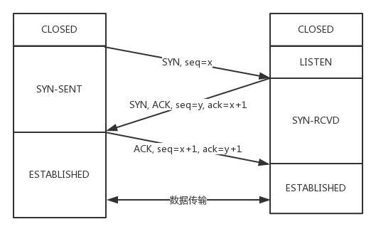
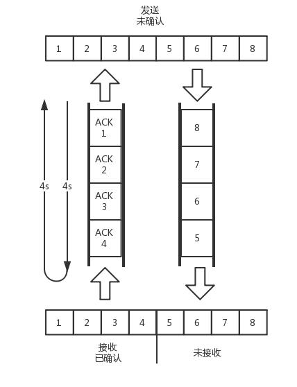

# 计算机网络

## TCP

### TCP连接过程（三握四挥）

**第一次握手**

客户端向服务端发送连接请求报文段。该报文段中包含自身的数据通讯初始序号。请求发送后，客户端便进入 SYN-SENT 状态。

**第二次握手**

服务端收到连接请求报文段后，如果同意连接，则会发送一个应答，该应答中也会包含自身的数据通讯初始序号，发送完成后便进入 SYN-RECEIVED 状态。

**第三次握手**

当客户端收到连接同意的应答后，还要向服务端发送一个确认报文。客户端发完这个报文段后便进入 ESTABLISHED 状态，服务端收到这个应答后也进入 ESTABLISHED 状态，此时连接建立成功。

这里可能大家会有个疑惑：为什么 TCP 建立连接需要三次握手，而不是两次？这是因为这是为了防止出现失效的连接请求报文段被服务端接收的情况，从而产生错误。

**第一次挥手**

若客户端 A 认为数据发送完成，则它需要向服务端 B 发送连接释放请求。

**第二次挥手**

B 收到连接释放请求后，会告诉应用层要释放 TCP 链接。然后会发送 ACK 包，并进入 CLOSE_WAIT 状态，此时表明 A 到 B 的连接已经释放，不再接收 A 发的数据了。但是因为 TCP 连接是双向的，所以 B 仍旧可以发送数据给 A。

**第三次挥手**

B 如果此时还有没发完的数据会继续发送，完毕后会向 A 发送连接释放请求，然后 B 便进入 LAST-ACK 状态。

**第四次挥手**

A 收到释放请求后，向 B 发送确认应答，此时 A 进入 TIME-WAIT 状态。该状态会持续 2MSL（最大段生存期，指报文段在网络中生存的时间，超时会被抛弃） 时间，若该时间段内没有 B 的重发请求的话，就进入 CLOSED 状态。当 B 收到确认应答后，也便进入 CLOSED 状态。

### 流量控制

在流量控制的机制里面，在对于包的确认中，会携带一个窗口的大小

简单的说一下就是接收端在发送 ACK 的时候会带上缓冲区的窗口大小，但是一般在窗口达到一定大小才会更新窗口，因为每次都更新的话，刚空下来就又被填满了

### 拥塞控制

也是通过窗口的大小来控制的，但是检测网络满不满是个挺难的事情，所以 TCP 发送包经常被比喻成往水管里灌水，所以拥塞控制就是在不堵塞，不丢包的情况下尽可能的发挥带宽。

水管有粗细，网络有带宽，即每秒钟能发送多少数据；水管有长度，端到端有时延。理想状态下，水管里面的水 = 水管粗细 * 水管长度。对于网络上，通道的容量 = 带宽 * 往返时延。

如果我们设置发送窗口，使得发送但未确认的包为通道的容量，就能撑满整个管道。

如图所示，假设往返时间为 8 秒，去 4 秒，回 4 秒，每秒发送一个包，已经过去了 8 秒，则 8 个包都发出去了，其中前四个已经到达接收端，但是 ACK 还没返回，不能算发送成功，5-8 后四个包还在路上，还没被接收，这个时候，管道正好撑满，在发送端，已发送未确认的 8 个包，正好等于带宽，也即每秒发送一个包，也即每秒发送一个包，乘以来回时间 8 秒。

如果在这个基础上调大窗口，使得单位时间可以发送更多的包，那么会出现接收端处理不过来，多出来的包会被丢弃，这个时候，我们可以增加一个缓存，但是缓存里面的包 4 秒内肯定达不到接收端课，它的缺点会增加时延，如果时延达到一定程度就会超时重传

TCP 拥塞控制主要来避免两种现象，包丢失和超时重传，一旦出现了这些现象说明发送的太快了，要慢一点。

具体的方法就是发送端慢启动，比如倒水，刚开始倒的很慢，渐渐变快。然后设置一个阈值，当超过这个值的时候就要慢下来

慢下来还是在增长，这时候就可能水满则溢，出现拥塞，需要降低倒水的速度，等水慢慢渗下去。

拥塞的一种表现是丢包，需要超时重传，这个时候，采用快速重传算法，将当前速度变为一半。所以速度还是在比较高的值，也没有一夜回到解放前。

## UDP

UDP直接发送报文，不管对方是什么状态，也没有那么多复杂的流程

## TCP和UDP对比

|              | UDP                                        | TCP                                    |
| ------------ | ------------------------------------------ | -------------------------------------- |
| 是否连接     | 无连接                                     | 面向连接                               |
| 是否可靠     | 不可靠传输，不使用流量控制和拥塞控制       | 可靠传输，使用流量控制和拥塞控制       |
| 连接对象个数 | 支持一对一，一对多，多对一和多对多交互通信 | 只能是一对一通信                       |
| 传输方式     | 面向报文                                   | 面向字节流                             |
| 首部开销     | 首部开销小，仅8字节                        | 首部最小20字节，最大60字节             |
| 适用场景     | 适用于实时应用（IP电话、视频会议、直播等） | 适用于要求可靠传输的应用，例如文件传输 |