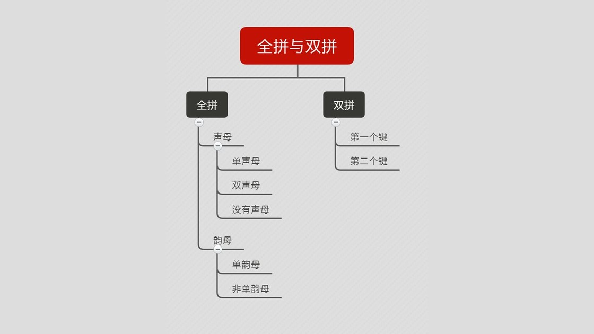
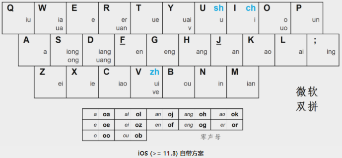

# 微软双拼

## 快速上手

### 理解双拼

双拼的核心原则，就是基于拼音，用两个按键对应声母和韵母，第一个键用来输入声母，第二个健来输入韵母。

> 

### 声母

- 声母可以分为单声母，如 q、w、r、t 等，它们只有一个字符，直接与键盘上的按键相对应
- 双声母有3个，分别是 zh、ch、sh ，使用某个单韵母的键与之对应，如 zh - v、ch - i、sh - u 。因为双拼的原则是第一个键为声母，所以用户如果在第一个键上按了韵母，那一定就是需要转换的非单声母了
- 还有一些拼音没有声母，比如 爱（ai），由于双拼的原则是一定要用两个键输入一个字，不能把声母位置空出来，所以必须给这种类型的拼音单独考虑。一般有两种处理方法：第一种是微软双拼等采用的设一个韵母键[o]做「零声母」键来补声母

### 韵母

- 韵母也有单韵母，如 a、o、e、i 等，与单声母的处理方式一样，直接与键盘上的按键相对应
- 剩下的韵母有很多种，但是由于它们不只由一个字符组成，所以都用单声母的键与之对应。某些键还可以与多个韵母对应

### 键位图

